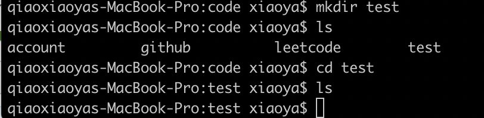
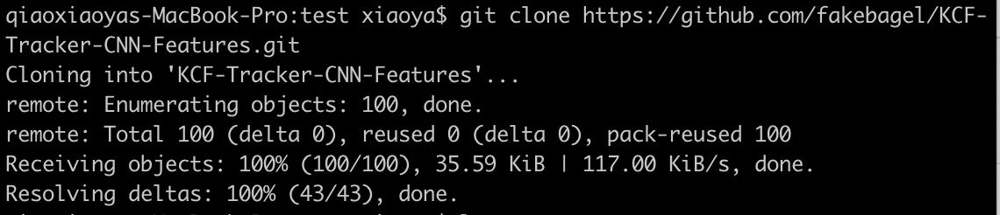
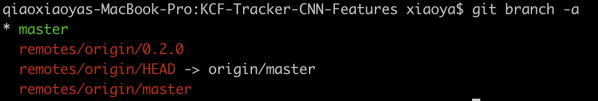
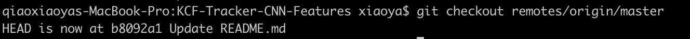
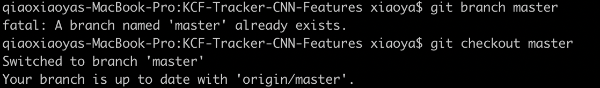
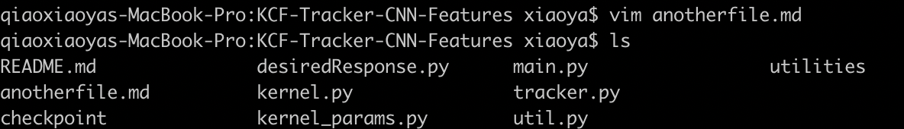
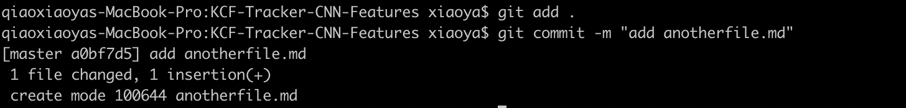
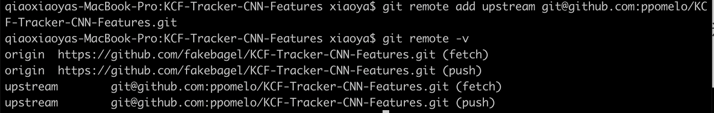
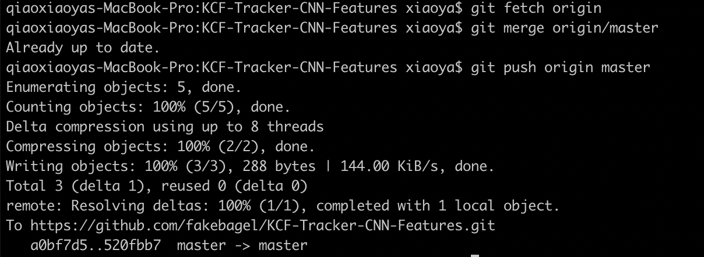

## 使用git参与贡献

### 1.Git简介

Git是目前世界上最先进的分布式版本控制系统。更重要的是限制相对较少。

### 2.Git安装

##### Linux

sudo apt-get install git

##### Mac OS X

安装homebrew

```bash
/usr/bin/git -e "$(curl -fsSL https://raw.githubusercontent.com/Homebrew/install/master/install)"
```

 安装git

```undefined
brew install git
```

##### Windows

在Windows上使用Git，可以从Git官网直接[下载安装程序](https://git-scm.com/downloads)，（网速慢的同学请移步[国内镜像](https://pan.baidu.com/s/1kU5OCOB#list/path=%2Fpub%2Fgit)），然后按默认选项安装即可。

##### 进行设置

```
$ git config --global user.name "Your Name"
$ git config --global user.email "email@example.com"
```

### 3.Git基本使用

1) fork项目到自己的仓库


2) 在本地创建一个空文件夹test，用来放置clone进来的代码



3) cd进入空文件夹

4) git clone开源项目的源代码到本地

```bash
git clone https://github.com/fakebagel/KCF-Tracker-CNN-Features.git
```



5)cd进入代码所在文件夹

6)查看开源项目的所有分支

```bash
git branch -a
```



7) 切换到某远程分支

```bash
git checkout remotes/origin/xxx
```



8) 基于远程分支新建本地分支

```bash
git branch xxx
git checkout xxx
```



9) 自行修改文件



10)添加修改

```bash
git add .
```

11) 提交修改

```bash
git commit -m "description"
```



12)与上游项目进行关联

```bash
git remote add upstream git@github.com:xxxxxx/<reponame>.git
```



13)推送本地的分支到fork之后的仓库中

```bash
git fetch origin
git merge origin/xxx
```

14)最后push自己的分支到自己fork过的仓库中.

```bash
git push origin xxx
```



15) 在项目的pull request中添加自己刚修改过的文件, 点"comment pull request"即可.


